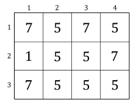
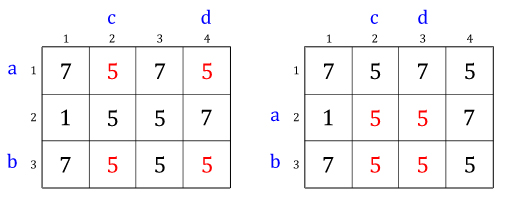
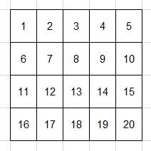
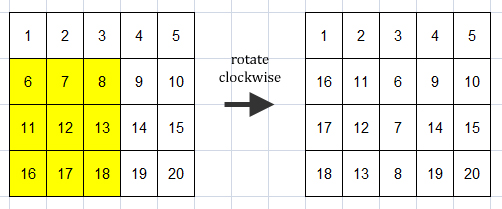
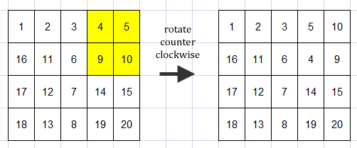
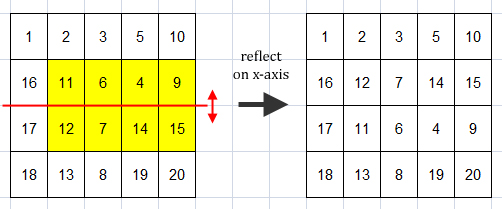
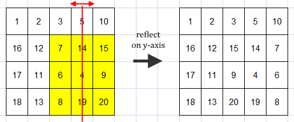
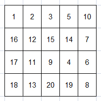

# Problems

- [A - String Matching](#a---string-matching)
- [B - Compact Bag](#b---compact-bag)
- [C - Beautiful Quadruple](#c---beautiful-quadruple)
- [D - Arithmetic Sequence](#d---arithmetic-sequence)
- [E - Legendary Dance](#e---legendary-dance)
- [F - Shady Antique Collector](#f---shady-antique-collector)
- [G - Beautiful Triple](#g---beautiful-triple)
- [H - Negotiation Game](#h---negotiation-game)
- [I - Irpin's Walk](#i---irpins-walk)
- [J - Rational Number](#j---rational-number)
- [K - Operations on Matrix](#k---operations-on-matrix)

# A - String Matching

| Time Limit   | 1s   |
|--------------|------|
| Memory Limit | 64MB |

## Description

String matching is an important problem where we want to find whether a string (or sometimes called pattern) can be found within a larger string. In other words, whether a pattern P exists as a substring of string S. Naively, we can solve this problem by iterating through all possible substrings of S in O(|S|^2) time, but usually the length of S and P are quite large such that a quadratic time-complexity solution like this is not fast enough. This problem has been studied extensively (e.g., in computational biology) and many algorithms have been proposed to solve this problem. You may have heard (or better, familiar with) some of these well-known algorithms: Knuth-Morris-Prat (KMP) algorithm, Rabin-Karp algorithm, and	Aho-Corasick algorithm. These algorithms can solve the string matching problem in linear time-complexity.

Red is the founder of a new start-up game developer company. When Red developed his first game with his team, Red found the exact problem which he has learnt back in his undergraduate study, the string matching problem. However, being an ignorant person, Red did not pay much attention on this subject and managed to barely pass the exam. Red delegated this problem to one of his new programmer which also is a fresh-graduate, with the hope that this new guy still remember the linear time-complexity solution for this problem.

Unfortunately, instead of implementing a (correct) string matching algorithm, this new guy implemented a wrong one:

1. Let P be the pattern and S be the string.
2. If |P| > |S|, then output "NO" and terminate.
3. If P is a prefix of S, then output "YES" and terminate; otherwise
4. Let x be the smallest index where Px ≠ Sx,
5. Update S as suffix of S starting from index x + 1, then back to step 2.

Knowing that his solution is linear time-complexity, this new guy is confident that this solution works. However, of course you, being a competitive programmer, realize that this solution is simply wrong.

For example, let P = "ABABC" and S = "ABABABCABA".

First round:

	S: ABABABCABA
	P: ABABC

P is not a prefix of S and P4 ≠ S4 (x = 4 in 0-based index), so update S as suffix of S starting from index 4 + 1 (= 5): ABABABCABA → BCABA.

Second round:

	S: BCABA
	P: ABABC

P is not a prefix of S and P0 ≠ S0 (x = 0 in 0-based index), so update S as suffix of S starting from index 0 + 1 (= 1): BCABA → CABA.

Third round:

	S: CABA
	P: ABABC

|S| is lower than |P| (4 < 5), so output "NO" and terminate.

Therefore, this algorithm will produce "NO" output for P = ABABC and S = ABABABCABA, even though we can find P in S: AB(ABABC)ABA.

You want to analyze the damages caused by this algorithm, so, as the first step, you should reproduce this algorithm. Given a pattern P and a string S, output whether P exists in S according to the aforementioned algorithm.

## Input

The first line of input contains an integer T (T ≤ 100) denoting the number of cases. Each case contains two string P and S separated by a single space denoting the pattern and the string, respectively. P and S consist of uppercase alphabetic characters only (A-Z) and have length between 1 and 20,000 characters.

## Output

For each case, output in a line "Case #X: Y" where X is the case number, starts from 1, and Y is the output of the algorithm described in the problem statement (YES or NO).

## Sample Input

	5
	ABABC ABABABCABA
	ABC ABABCAB
	ICPC ACMICPCJAKARTA
	BABAT BABABABABAT
	INC INC

## Sample Output

	Case #1: NO
	Case #2: NO
	Case #3: YES
	Case #4: YES
	Case #5: YES

# B - Compact Bag

| Time Limit   | 1s   |
|--------------|------|
| Memory Limit | 64MB |

## Description

In mathematics, a bag (or multiset) refers to a collection of objects/elements. This concept is similar to set, but it allows multiple instances of the same object. For example, {2, 4, 4} and {2, 2, 4} are two different bags even though they are the same set of {2, 4}.

Similar to subset, subbag is a partial bag where each element of it is taken from a bag. For example, follows are all different subbags of a bag {2, 4, 4}:

- { } – empty bag (∅)
- {2}
- {4}
- {2, 4}
- {4, 4}
- {2, 4, 4}

Likewise, the size of a bag or subbag is the number of objects in the bag/subbag.

Given a bag B of N elements and a threshold integer K, your task is to determine the size of the largest-size subbag of B where the difference between any two elements in that subbag is no more than K.

## Input

The first line of input contains an integer T (T ≤ 100) denoting the number of cases. Each case begins with two integers: N and K (1 ≤ N ≤ 1,000; 0 ≤ K ≤ 2,000,000,000) denoting the size of the given bag and the threshold integer as explained in the problem statement, respectively. The next line contains N integers Bi (-1,000,000,000 ≤ Bi ≤ 1,000,000,000) representing the elements in the bag.

## Output

For each case, output in a line "Case #X: Y" where X is the case number, starts from 1, and Y is the output for that particular case.

## Sample Input

	4
	3 1
	2 4 4
	3 2
	2 4 4
	7 3
	19 17 21 21 -10 17 18
	9 10
	20 100 100 20 20 103 20 105 100

## Sample Output

	Case #1: 2
	Case #2: 3
	Case #3: 4
	Case #4: 5

## Explanation

*Explanation for 1st sample case*

The largest subbag is {4, 4} of size 2. We cannot have {2, 4, 4} as the answer because the difference between 2 and 4 is 2, which is larger than 1.

*Explanation for 2nd sample case*

The largest subbag is {2, 4, 4} of size 3.

*Explanation for 3rd sample case*

The largest subbag is {19, 17, 17, 18} of size 4.

*Explanation for 4th sample case*

The largest subbag is {100, 100, 103, 105, 100} of size 5. The largest difference between any two elements in this subbag is 5 (100 and 105), and it's no more than 10.

# C - Beautiful Quadruple

| Time Limit   | 5s   |
|--------------|------|
| Memory Limit | 64MB |

## Description

In a matrix of integers M, mi,j denotes the element of the matrix at ith row and jth column. A quadruple ⟨a, b, c, d⟩ of M is considered beautiful if and only if (a < b), (c < d), and ma,c = ma,d = mb,c = mb,d in matrix M.

Given a matrix of integers M, determine how many beautiful quadruple of M there are.

For example, consider the following matrix of 3 x 4:

There are two beautiful quadruples, i.e. ⟨1, 3, 2, 4⟩ and ⟨2, 3, 2, 3⟩, as shown in the following figures.

There are no other quadruples which are beautiful, thus, in this example, the output is 2.

## Input

The first line of input contains an integer T (T ≤ 100) denoting the number of cases. Each case begins with two integers R and C (2 ≤ R, C ≤ 150) denoting the size of the matrix (row and column respectively). The next R lines each contains C integers mi,j (1 ≤ mi,j ≤ 10^9) representing the matrix's element, respectively for i = 1..R and j = 1..C.

## Output

For each case, output in a line "Case #X: Y" where X is the case number, starts from 1, and Y is the output for that particular case.

## Sample Input

	4
	3 4
	7 5 7 5
	1 5 5 7
	7 5 5 5
	2 3
	1 1 1
	1 1 1
	4 5
	1 2 3 4 5
	6 7 8 9 10
	11 12 13 14 15
	16 17 18 19 20
	3 4
	2 8 3 2
	2 3 3 2
	2 3 3 2

## Sample Output

	Case #1: 2
	Case #2: 3
	Case #3: 0
	Case #4: 4

# D - Arithmetic Sequence

| Time Limit   | 4s   |
|--------------|------|
| Memory Limit | 64MB |

## Description

A sequence of integers ( x1, x2, ..., xm ) is an arithmetic sequence if the difference between any two consecutive elements are the same. In other words, xi - xi+1 = xj - xj+1 for any 1 ≤ i ≤ j < m. By definition, any sequence with less than three integers is also an arithmetic sequence.

Given a sequence of integers a1, a2, ..., an and Q queries, where each query is one of the following:

1. 1 p q : change the value of ap into q.
2. 2 s t : output whether ( as, as+1, ..., at ) is an arithmetic sequence.

For each query of the first type (i), the change is reflected in the original sequence and may affect any future queries. For each query of the second type (ii), you should ouput "YES" or "NO" whether it satisfies the query.

For example, let there be a sequence a1..5 = ( 2, 4, 8, 14, 20 ) and 5 queries:

- 2 3 5 : is a3..5 = ( 8, 14, 20 ) an arithmetic sequence? output: YES.
- 2 1 3 : is a1..3 = ( 2, 4, 8 ) an arithmetic sequence? output: NO.
- 1 3 6 : change a3 into 6, so the sequence becomes a1..5 = ( 2, 4, 6, 14, 20 )
- 2 1 3 : is a1..3 = ( 2, 4, 6 ) an arithmetic sequence? output: YES.
- 2 3 5 : is a3..5 = ( 6, 14, 20 ) an arithmetic sequence? output: NO.

## Input

The first line of input contains an integer T (T ≤ 10) denoting the number of cases. Each case begins with two integers N and Q (1 ≤ N, Q ≤ 50,000) denoting the number of integers in the sequence and the number of queries, respectively. The next line contains N integers a1, a2, ..., aN (1 ≤ ai ≤ 1,000,000,000) each separated by a single space, representing the given sequence. The next Q lines represent the queries, where each line is one of the following:

1. 1 p q (1 ≤ p ≤ N; 1 ≤ q ≤ 1,000,000,000).
2. 2 s t (1 ≤ s ≤ t ≤ N).

## Output

For each case, output in a line "Case #X:" where X is the case number, starts from 1. For each query of the second type (ii), output "YES" or "NO" (without quotes) in a single line whether the query is satisfied.

## Sample Input

	2
	5 5
	2 4 8 14 20
	2 3 5
	2 1 3
	1 3 6
	2 1 3
	2 3 5
	10 4
	1 2 3 4 5 6 7 8 9 10
	2 1 10
	1 4 6
	2 4 5
	2 3 5

## Sample Output

	Case #1:
	YES
	NO
	YES
	NO
	Case #2:
	YES
	YES
	NO

## Explanation

*Explanation for 2nd sample case*

The original sequence a1..10 = ( 1, 2, 3, 4, 5, 6, 7, 8, 9, 10 ); and there are 4 queries:

- 2 1 10 : is a1..10 = ( 1, 2, 3, 4, 5, 6, 7, 8, 9, 10 ) an arithmetic sequence? output: YES.
- 1 4 6 : change a4 into 6, so the sequence becomes a1..10 = ( 1, 2, 3, 6, 5, 6, 7, 8, 9, 10 ).
- 2 4 5 : is a4..5 = ( 6, 5 ) an arithmetic sequence? output: YES.
- 2 3 5 : is a3..5 = ( 3, 6, 5 ) an arithmetic sequence? output: NO.

# E - Legendary Dance

| Time Limit   | 4s   |
|--------------|------|
| Memory Limit | 64MB |

## Description

Once upon a time, there was a legendary and very beautiful dance in ancient time performed only in king's coronation ceremony. The time of kings has passed and now we have a president as the head of our beloved nation. However, as a computer science student who loves art and history, Sandy is very interested in this legend and wanted to know more about this dance. He spent the whole afternoons during his short-term break in his school library, and finally found out that someone has resurrected the legendary dance. The details are put in two video records.

Let's agree on some definitions first so that explaining the problem becomes easier.

- A dance consists of one or more dance-moves in order, or simply "move".
- Each move is represented by an integer. Two integers of the same value represent a same move.
- A sequence of moves contains one or more moves in order, but not necessarilly continuous moves. For example, let a dance represented by a (complete) sequence of moves: 1 – 2 – 2 – 3 – 4 – 5. In this dance, 1 – 2 – 4 is one valid sequence, while 5 – 3 is not.

Let's get back to the main story. The two video records, each contains one sequence of moves which is believed to be part of the legendary dance. Now, Sandy is curious; assuming the dance sequence in these videos are indeed part of the legendary dance, how many dance moves in total will there be in the complete legendary dance? As there are no indication that these two videos are complete, Sandy is only interested in the minimum possible number of moves of the legendary dance. Note that however these two videos may contain an overlapping dance moves.

For example, let the two sequences be A = 10 – 17 – 10, and B = 17 – 12 – 10 – 10 – 15. Then, the minimum possible number of moves in the complete dance will be 6 (as shown below).

	A :  10 17    10
	B :     17 12 10 10 15
	----------------------
	C :  10 17 12 10 10 15

Of course C is not necessarily the legendary dance, but any legendary dance will have at least 6 moves as shown in C.

Your task in this problem is, given two sequence of moves which are part of the legendary dance, determine the minimum possible number of moves in the complete legendary dance.

## Input

The first line of input contains an integer T (1 ≤ T ≤ 100) denoting the number of cases. Each case begins with two integers in a line N and M (1 ≤ N, M ≤ 1,000) denoting the number of moves recorded in both video records. The second line of each case contains N integers Ai (1 ≤ Ai ≤ 2,000) representing the a sequence of dance moves in the first record. The third line of each case contains M integers Bi (1 ≤ Bi ≤ 2,000) representing a sequence of dance moves in the second record.

## Output

For each case, output in a line "Case #X:" where X is the case number, starts from 1, and Y is the minimum possible number of moves in the legendary dance for that particular case.

## Sample Input

	4
	3 5
	10 17 10
	17 12 10 10 15
	4 4
	1 2 3 4
	5 6 7 8
	4 4
	1 2 3 4
	1 2 3 4
	4 4
	1 2 3 4
	2 3 4 5

## Sample Output

	Case #1: 6
	Case #2: 8
	Case #3: 4
	Case #4: 5

## Explanation

*Explanation for 2nd sample case*

There are no common moves recorded on both records. Any possible legendary dance should consist of at least 8 moves.

*Explanation for 3rd sample case*

Both records contain the same dance moves. It might be possible that both of them are the complete legendary dance.

# F - Shady Antique Collector

| Time Limit   | 10s   |
|--------------|------|
| Memory Limit | 64MB |

## Description

Blue is a shady antique collector. Recently, through his shady connection, he managed to get himself a map of a certain dungeon which is known to be the home of some antique treasures. Fortunately for him, the map also came with the location of each treasure. The dungeon can be represented as a grid map of R rows and C columns. Each character in the map is:

- 'E' – represents the entrance/exit to the dungeon (you're also able to pass through this cell without exiting),
- '.' – represents an empty cell,
- '#' – represents an obstacle (you cannot go through this cell),
- '0' .. '9' – represents a cell with treasure (different number means different kind of treasure).

You always starts from the cell indicated by character 'E', which also serves as your exit point. From any cell, you can only move to its adjacent cells (north, south, west, east) given the destination cell is not an obstacle or out of the map.

Blue is a shady antique collector; he is neither an explorer nor hunter. He can hire one or more explorers from the Association for Collector and Marvel. However, the price of hiring explorers does not depend on the number of explorers being hired (he can hire all the available explorers if he want), but strictly depends on the time used by the explorers to do the exploring; specifically, the longest time spent by any explorer. Moreover, the explorers accept the direction given by Blue, in other words, the explorers movement are fully determined by Blue.

Blue decides to get at least K unique treasures from this dungeon. Note that there may be more than one of each treasure which are identical (represented by the same number in the map), but Blue's only concern is K unique treasures regardless of the total quantity. Help him to determine the minimum time required to collect at least K unique treasures when there are M explorers available for hire. Assume moving to adjacent cell cost 1 unit of time and picking any treasure cost no time.

For example, let's consider the following map of 5 x 5:

	E#1.0
	.##.#
	....#
	###.4
	32442

There are 5 unique treasures in this map (0, 1, 2, 3, and 4) with some duplicates (e.g., there are two treasure 2, and three treasure 4).

Let K = 4, if there is only 1 available explorer, then he needs 24 unit of times. Follow is one example path. Blue color represents the starting point, red color represents the path; notice that there are 24 red marks on this example. The collected treasures are 0, 1, 2, and 4.

	E#1.0   E#1.0   E#1.0   E#1.0   E#1.0
	.##.#   .##.#   .##.#   .##.#   .##.#
	....#   ....#   ....#   ....#   ....#
	###.4   ###.4   ###.4   ###.4   ###.4
	32442   32442   32442   32442   32442

If there are 2 available explorers (and K = 4), then they need 18 unit of time. Follow is one example to achieve that. Explorer #1 collects treasure 0 and 1 in 18 unit of time, while Explorer #2 collects treasure 2 and 4 in 16 unit of time. Thus, the total time is max(18, 16) = 18 unit of time.

Path for Explorer #1 (collecting treasure 0 and 1) – 18 unit of time:

	E#1.0   E#1.0   E#1.0
	.##.#   .##.#   .##.#
	....#   ....#   ....#
	###.4   ###.4   ###.4
	32442   32442   32442

Path for Explorer #2 (collecting treasure 2 and 4) – 16 unit of time:

	E#1.0   E#1.0   E#1.0
	.##.#   .##.#   .##.#
	....#   ....#   ....#
	###.4   ###.4   ###.4
	32442   32442   32442

## Input

The first line of input contains an integer T (T ≤ 100) denoting the number of cases. Each case begins with four integers: R, C, K, M (2 ≤ R, C ≤ 30; 0 ≤ K ≤ 10; 1 ≤ M ≤ 50) denoting the number of rows and columns of the map, minimum number of unique treasures required by Blue, and number of available explorers, respectively. The next R following lines each contains C characters representing the given map. Each character in the map is one of the following: E0123456789.# which meaning can be found in the problem statement. There will be exactly one 'E' in the map.

## Output

For each case, output in a line "Case #X: Y" where X is the case number, starts from 1, and Y is the minimum time required to collect at least K unique treasures with M explorers for that particular case, or -1 if it's not possible to do so.

## Sample Input

	4
	5 5 4 1
	E#1.0
	.##.#
	....#
	###.4
	32442
	5 5 4 2
	E#1.0
	.##.#
	....#
	###.4
	32442
	3 5 5 5
	..E.3
	.###0
	.73#3
	7 7 4 4
	..#321.
	2.#.#..
	3##.###
	0..E..2
	###.##1
	..#.#.0
	.301#..

## Sample Output

	Case #1: 24
	Case #2: 18
	Case #3: -1
	Case #4: 6

## Explanation

*Explanation for 3rd sample case*

There are only 3 unique treasures in the given map (0, 3, and 7), thus, there's no way to get 5 unique treasures in this case.

*Explanation for 4th sample case*

Dispatch each explorer to different direction and collects only the nearest treasure.

# G - Beautiful Triple

| Time Limit   | 2s   |
|--------------|------|
| Memory Limit | 64MB |

## Description

In a sequence of N integers A1..N, a triple ⟨a, b, c⟩ is considered beautiful if Aa = Ac and 1 ≤ a < b < c ≤ N.

For example, a sequence A1..6 = {3, 1, 3, 7, 3, 7} has 6 beautiful triples:

- ⟨1, 2, 3⟩ – A1 = 3, A2 = 1, A3 = 3.
- ⟨1, 2, 5⟩ – A1 = 3, A2 = 1, A5 = 3.
- ⟨1, 3, 5⟩ – A1 = 3, A3 = 3, A5 = 3.
- ⟨1, 4, 5⟩ – A1 = 3, A4 = 7, A5 = 3.
- ⟨3, 4, 5⟩ – A1 = 3, A4 = 7, A5 = 3.
- ⟨4, 5, 6⟩ – A4 = 7, A5 = 3, A6 = 7.

Given a sequence of integers, determine how many beautiful triples are there in the sequence. Modulo the output with 1,000,000,007.

## Input

The first line of input contains an integer T (T ≤ 50) denoting the number of cases. Each case begins with an integer N (1 ≤ N ≤ 100,000) denoting the size of the integer sequence. The next line contains N integers Ai (1 ≤ Ai ≤ 100,000) representing the elements in A, for i = 1..N respectively.

## Output

For each case, output in a line "Case #X: Y" where X is the case number, starts from 1, and Y is the output for that particular case.

## Sample Input

	4
	6
	3 1 3 7 3 7
	3
	5 5 5
	7
	35 35 35 35 35 35 35
	4
	102 38 173 25

## Sample Output

	Case #1: 6
	Case #2: 1
	Case #3: 35
	Case #4: 0

# H - Negotiation Game

| Time Limit   | 2s   |
|--------------|------|
| Memory Limit | 64MB |

## Description

Adi and Irvan is a best friends duo. They play, they eat, they joke, they smile, and they fight each other (note: it's a best friend kind of fight). They are also phd candidates (computer science), so, of course they discuss their research together. They often solve their disputes by their so-called "smart" negotiation.

One day, Adi and Irvan are faced with an array of N integer, A[1..N]. Looking at this array, Adi and Irvan tempted to pick one element to bring home. However, together they can only choose exactly one element only to bring home. Problem arises, when they disagree on the element which should be chosen. Adi wants the value to be as large as possible, while Irvan wants the value to be as small as possible.

Being an eccentric person, Irvan suggests an unconventional way to solve this dispute. Adi and Irvan will take turns doing these procedures (split_and_keep) to reduce the size of A while it still has more than 1 element in it. As an older one, Adi moves first.

	1   split_and_keep(A[1..M])
	2      x ← between 1 and M-1, inclusive
	3      B ← either A[1..x] or A[x+1..M]
	4      A = B

Line 2 and 3 in split_and_keep pseudocode above is where Adi and Irvan make a decision (recall that their objectives are different). Notice that every call of split_and_keep will reduce the size of A. The only element remains in A at the end will be their chosen element.

If Adi and Irvan play this negotiation (game) optimally, i.e. Adi tries to minimize the chosen element while Irvan tries to maximize it, what will the value of the chosen element be?

For example, let A = {7, 3, 4, 8, 7, 4}. One possible game will proceed like this:

	A = 7 3 4 8 7 4
	                 Adi   : x = 2 and pick A[3..6] = {4, 8, 7, 4}
	A = 4 8 7 4
	                 Irvan : x = 2 and pick A[1..2] = {4, 8}
	A = 4 8
	                 Adi   : x = 1 and pick A[1..1] = {4}
	A = 4

In this example play, the chosen element's value is 4, which happened to be the chosen value when both play optimally.

## Input

The first line of input contains an integer T (T ≤ 100) denoting the number of cases. Each case begins with an integer N (1 ≤ N ≤ 2,000) denoting the size of array A. The next line contains N integers Ai (1 ≤ Ai ≤ 1,000,000) representing the elements in A, for i = 1..N respectively.

## Output

For each case, output in a line "Case #X: Y" where X is the case number, starts from 1, and Y is the output for that particular case.

## Sample Input

	4
	6
	7 3 4 8 7 4
	2
	10 20
	1
	1000
	5
	5 4 3 2 1

## Sample Output

	Case #1: 4
	Case #2: 10
	Case #3: 1000
	Case #4: 1

# I - Irpin's Walk

| Time Limit   | 7s   |
|--------------|------|
| Memory Limit | 64MB |

## Description

Irpin loves to walk around in the city where he lives. There are N intersections (numbered from 1 to N) and M bidirectional roads in the city where each road connects exactly two different intersections. Two intersections may have more than one roads connecting them because the mayor wants people to have many alternatives for their journey in the city, e.g., one can use a shorter and posibly boring road, or one can use a longer road with nice scenery.

A walk in the city is defined as an alternating sequence of intersections and roads (starting and ending at an intersection), in which each road in the sequence is incident to both of its adjacent roads. Note that, unlike a path, a walk may have repeating intersections and roads in its sequence.

Let W (walk's length) be the sum of all road's length in the walk, and R be the number of roads in the walk. If 2^R ≤ W, then the cost of the walk is 2*W; otherwise the cost will simply be W. If you're wondering why such confusing method to calculate the walk cost, Irpin felt a short walk (walk which uses only few number of roads) is kind of "cheating"; therefore, he doubles the cost of any short walks, i.e. become 2*W instead of W.

Suppose Irpin wants to have a walk from intersection A to intersection B, help him determine the minimum cost walk among all possible walks from A to B.

## Input

The first line of input contains an integer T (T ≤ 50) denoting the number of cases. Each case begins with four integers: N M A B (2 ≤ N ≤ 10,000; 1 ≤ M ≤ 100,000; 1 ≤ A, B ≤ N; A ≠ B) representing the number of intersections, the number of roads, intersection in which the walk starts, and intersection in which the walk ends, respectively. The following M lines each contains three integers: u v w (1 ≤ u, v ≤ N; u ≠ v; 1 ≤ w ≤ 1,000) representing a bidirectional road of length w which connects intersection u and v.

## Output

For each case, output in a line "Case #X:" where X is the case number, starts from 1, and Y is the cost of the walk with minimum cost from A to B for that particular case. If there is no possible walk from A to B, then output -1 for Y.

## Sample Input

	3
	5 5 1 3
	1 2 2
	2 3 1
	1 4 2
	4 5 2
	5 3 1
	5 5 1 3
	1 2 3
	2 3 2
	1 4 3
	4 5 2
	5 3 2
	3 1 1 3
	1 2 3

## Sample Output

	Case #1: 3
	Case #2: 7
	Case #3: -1

## Explanation

*Explanation for 1st sample case*

The walk with minimum cost is 1 - 2 - 3. The walk length W is 2 + 1 = 3, while the number of roads R is 2. As 2R = 22 = 4 is larger than W = 3, then the cost is 3.

*Explanation for 2nd sample case*

Follows are two possible walks (among many other) from intersection 1 to 3:
1 - 2 - 3; in this walk, W = 3 + 2 = 5, and R = 2. Since 2^R = 2^2 = 4 is no more than W = 5, then cost for this walk is 2 * W = 2 * 5 = 10.
1 - 4 - 5 - 3; in this walk, W = 3 + 2 + 2 = 7, and R = 3. Since 2^R = 2^3 = 8 is more than W = 7, then cost for this walk is W = 7.
Of course there are infinitely many other walks from intersection 1 to 3, but among all of them, walk 1 - 4 - 5 - 3 has the lowest cost of 7.

*Explanation for 3rd sample case*

There are no possible walk from intersection 1 to 3.

# J - Rational Number

| Time Limit   | 1s   |
|--------------|------|
| Memory Limit | 64MB |

## Description

A rational number is any real number which can be written as the fraction a/b of two whole numbers (integers) a and b. One property of a rational number is it either terminates after a finite number of digits or it has a repeating decimal digits (r). Example of rational numbers are:

- 100	a = 100	b = 1	(terminates)
- -1.875	a = -15	b = 8	(terminates)
- 2.16	a = 13	b = 6	r = 6
- 7.27	a = 80	b = 11	r = 27
- 0.285714	a = 2	b = 7	r = 285714

The overlined numbers in above examples represent the repeating decimal digits, e.g., 2.16 means the number is 2.166666..., while 0.285714 means the number is 0.285714285714285714285714...; 100 and -1.875 do not have repeating decimal digits as they terminate.

In this problem, you are challenged to find the length of the repeating decimal digits of a rational number. In the examples above, when a = 13 and b = 6, then the length of its repeating decimal digits is 1; while, when a = 2 and b = 7, the length of its repeating decimal digits is 6.

## Input

The first line of input contains an integer T (T ≤ 100) denoting the number of cases. Each case contains two integers in a line: a b (-1,000,000,000 ≤ a, b ≤ 1,000,000,000; b ≠ 0) which represent the numerator and denominator of the rational number, respectively.

## Output

For each case, output in a line "Case #X:" where X is the case number, starts from 1, and Y is the length of the repeating decimal digits for that particular case.

## Sample Input

	5
	100 1
	-15 8
	13 6
	80 11
	2 7

## Sample Output

	Case #1: 0
	Case #2: 0
	Case #3: 1
	Case #4: 2
	Case #5: 6

# K - Operations on Matrix

| Time Limit   | 1s   |
|--------------|------|
| Memory Limit | 64MB |

## Description

In this problem, you are given a matrix A of N x M (i.e. A[1 .. N][1 .. M]) and Q queries where each query is one of the following:

- rotate cw r c s
	Rotate the square submatrix A[r .. r+s][c .. c+s] clockwise.
- rotate ccw r c s
	Rotate the square submatrix A[r .. r+s][c .. c+s] counterclockwise.
- reflect x r1 c1 r2 c2
	Reflect the submatrix A[r1 .. r2][c1 .. c2] on x-axis.
- reflect y r1 c1 r2 c2
	Reflect the submatrix A[r1 .. r2][c1 .. c2] on y-axis.

For example, consider the following matrix of 4 x 5:

Supposed there are 4 queries, respectively:

- rotate cw 2 1 2
	Rotate the square submatrix A[2 .. 2+2][1 .. 1+2], i.e. A[2 .. 4][1 .. 3] clockwise.

- rotate ccw 1 4 1
	Rotate the square submatrix A[1 .. 1+1][4 .. 4+1], i.e. A[1 .. 2][4 .. 5] clockwise.

- reflect x 2 2 3 5
	Reflect the submatrix A[2 .. 3][2 .. 5] on x-axis.

- reflect y 2 3 4 5
	Reflect the submatrix A[2 .. 4][3 .. 5] on y-axis.

Thus, after those queries, the final matrix becomes:

          
Your task is to output the final matrix after all queries are executed sequentially.

## Input

The first line of input contains an integer T (T ≤ 100) denoting the number of cases. Each case begins with three integers N M and Q (1 ≤ N, M ≤ 20; 1 ≤ Q ≤ 20) denoting the matrix size (N x M) and number of queries, respectively. The next N lines, each contains M integers Ai,j (1 ≤ Ai,j ≤ 1,000) representing the intial matrix. The next Q lines, each contains a query with one of the following format:

- rotate cw r c s (1 ≤ r ≤ r+s ≤ N; 1 ≤ c ≤ c+s ≤ M)
- rotate ccw r c s (1 ≤ r ≤ r+s ≤ N; 1 ≤ c ≤ c+s ≤ M)
- reflect x r1 c1 r2 c2 (1 ≤ r1 ≤ r2 ≤ N; 1 ≤ c1 ≤ c2 ≤ M)
- reflect y r1 c1 r2 c2 (1 ≤ r1 ≤ r2 ≤ N; 1 ≤ c1 ≤ c2 ≤ M)

## Output

For each case, output in a line "Case #X:" where X is the case number, starts from 1. The next N lines in each case, each contains M integers each separated by a single space. These integers represent the final matrix after all queries are executed sequentially.

## Sample Input

	2
	4 5 4
	1 2 3 4 5
	6 7 8 9 10
	11 12 13 14 15
	16 17 18 19 20
	rotate cw 2 1 2
	rotate ccw 1 4 1
	reflect x 2 2 3 5
	reflect y 2 3 4 5
	3 3 2
	10 10 10
	1 3 9
	20 15 17
	reflect x 1 1 3 3
	rotate cw 1 1 2

## Sample Output

	Case #1:
	1 2 3 5 10
	16 12 15 14 7
	17 11 9 4 6
	18 13 20 19 8
	Case #2:
	10 1 20
	10 3 15
	10 9 17
