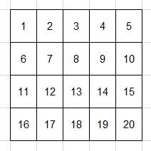
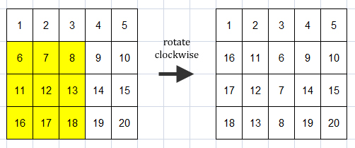
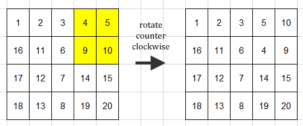
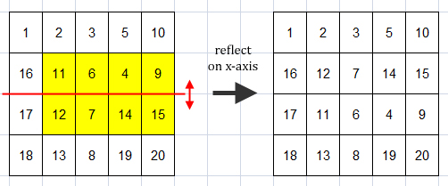
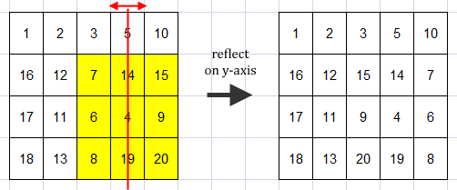
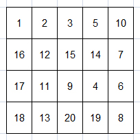

# K - Operations on Matrix

| Time Limit   | 1s   |
|--------------|------|
| Memory Limit | 64MB |

## Description

In this problem, you are given a matrix A of N x M (i.e. A[1 .. N][1 .. M]) and Q queries where each query is one of the following:

- rotate cw r c s
	Rotate the square submatrix A[r .. r+s][c .. c+s] clockwise.
- rotate ccw r c s
	Rotate the square submatrix A[r .. r+s][c .. c+s] counterclockwise.
- reflect x r1 c1 r2 c2
	Reflect the submatrix A[r1 .. r2][c1 .. c2] on x-axis.
- reflect y r1 c1 r2 c2
	Reflect the submatrix A[r1 .. r2][c1 .. c2] on y-axis.

For example, consider the following matrix of 4 x 5:

Supposed there are 4 queries, respectively:

- rotate cw 2 1 2
	Rotate the square submatrix A[2 .. 2+2][1 .. 1+2], i.e. A[2 .. 4][1 .. 3] clockwise.

- rotate ccw 1 4 1
	Rotate the square submatrix A[1 .. 1+1][4 .. 4+1], i.e. A[1 .. 2][4 .. 5] clockwise.

- reflect x 2 2 3 5
	Reflect the submatrix A[2 .. 3][2 .. 5] on x-axis.

- reflect y 2 3 4 5
	Reflect the submatrix A[2 .. 4][3 .. 5] on y-axis.

Thus, after those queries, the final matrix becomes:

          
Your task is to output the final matrix after all queries are executed sequentially.

## Input

The first line of input contains an integer T (T ≤ 100) denoting the number of cases. Each case begins with three integers N M and Q (1 ≤ N, M ≤ 20; 1 ≤ Q ≤ 20) denoting the matrix size (N x M) and number of queries, respectively. The next N lines, each contains M integers Ai,j (1 ≤ Ai,j ≤ 1,000) representing the intial matrix. The next Q lines, each contains a query with one of the following format:

- rotate cw r c s (1 ≤ r ≤ r+s ≤ N; 1 ≤ c ≤ c+s ≤ M)
- rotate ccw r c s (1 ≤ r ≤ r+s ≤ N; 1 ≤ c ≤ c+s ≤ M)
- reflect x r1 c1 r2 c2 (1 ≤ r1 ≤ r2 ≤ N; 1 ≤ c1 ≤ c2 ≤ M)
- reflect y r1 c1 r2 c2 (1 ≤ r1 ≤ r2 ≤ N; 1 ≤ c1 ≤ c2 ≤ M)

## Output

For each case, output in a line "Case #X:" where X is the case number, starts from 1. The next N lines in each case, each contains M integers each separated by a single space. These integers represent the final matrix after all queries are executed sequentially.

## Sample Input

	2
	4 5 4
	1 2 3 4 5
	6 7 8 9 10
	11 12 13 14 15
	16 17 18 19 20
	rotate cw 2 1 2
	rotate ccw 1 4 1
	reflect x 2 2 3 5
	reflect y 2 3 4 5
	3 3 2
	10 10 10
	1 3 9
	20 15 17
	reflect x 1 1 3 3
	rotate cw 1 1 2

## Sample Output

	Case #1:
	1 2 3 5 10
	16 12 15 14 7
	17 11 9 4 6
	18 13 20 19 8
	Case #2:
	10 1 20
	10 3 15
	10 9 17
