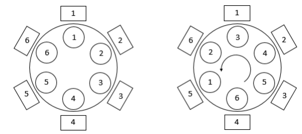

# E - Meja Putar

| Time Limit   | 3s    |
|--------------|-------|
| Memory Limit | 512MB |

## Deskripsi

Di sebuah pesta, makanan dihidangkan di atas meja putar yang besar. Karena ini adalah meja putar, maka ketika hidangan yang kita inginkan terletak terlalu jauh, kita dapat memutar meja
agar hidangan tersebut sampai tepat di depan kita.

Malam ini, disajikan tepat N hidangan berbeda untuk N orang tamu. Awalnya, tamu 1 menghadap hidangan 1, tamu 2 menghadap hidangan 2, dan seterusnya hingga tamu N menghadap hidangan N. Apabila meja diputar k posisi ke kiri, Maka tamu 1 jadi menghadap hidangan ke 1+k MOD N, tamu 2 menghadap hidangan ke 2+k MOD N, hingga tamu ke N menghadap hidangan ke k. Lihat skema berikut untuk memperjelas.

Meja untuk N=6 tamu, diputar sebanyak k=2 ke kiri.

Mengikuti tradisi, sebelum makan setiap tamu dibagikan secarik kertas yang memuat daftar hidangan dalam urutan acak. Urutan tersebut berbeda dari tamu ke tamu. Setiap tamu diwajibkan menyantap hidangan berdasarkan daftar tersebut. Awalnya, tamu akan menyantap hidangan teratas pada daftar. Setelah itu, ia akan mencoret entri tersebut dan menyantap hidangan teratas berikutnya pada daftar, begitu terus hingga semua hidangan tersantap.

Jelas bahwa tamu hanya boleh mengambil hidangan yang tepat berada di hadapannya, dan hanya saat meja berhenti berputar. Apabila hidangan yang saat ini berada di hadapan suatu tamu adalah yang teratas pada daftar, tamu akan menyantap hidangan itu. Namun apabila bukan, tamu tersebut akan diam saja.

Pak Umon datang dengan kekasihnya dan mereka memutuskan untuk menghabiskan makanan secepat mungkin supaya mereka bisa cepat turun ke lantai dansa. Anda sebagai juru putar, dipercaya Pak Umon untuk melakukan misi ini. Tentukan minimal berapa kali meja harus diputar, agar Pak Umon dan kekasihnya dapat menyelesaikan makan malamnya. Meja dapat diputar ke posisi manapun dalam 1 kali putaran.

## Format Masukan

Baris pertama berisi bebuah integer T, yaitu banyaknya kasus uji.
Untuk setiap kasus uji:
Baris pertama berisi tiga integer N, pU, dan pK, yaitu banyaknya tamu, posisi tempat duduk Pak Umon, dan posisi tempat duduk kekasihnya.
Baris kedua berisi N integer, yaitu urutan hidangan yang harus disantap Pak Umon.
Baris ketiga berisi N integer, yaitu urutan hidangan yang harus disantap kekasih Pak Umon

## Format Keluaran

Untuk setiap kasus uji, keluarkan sebaris berformat berikut.
	Case #c: ans
c adalah nomor kasus uji (dimulai dari 1), dan ans adalah sebuah integer yang menyatakan jumlah
minimal meja harus diputar

## Contoh Masukan

	3
	6 1 3
	1 2 3 4 5 6
	3 4 5 6 1 2
	6 3 5
	1 2 3 4 5 6
	3 4 5 6 1 2
	3 3 2
	2 3 1
	1 3 2

## Contoh Keluaran

	Case #1: 5
	Case #2: 6
	Case #3: 4

## Penjelasan

Untuk kasus pertama, Pak Umon dan kekasihnya dapat langung menyantap hidangan pertama tanpa meja diputar. Hidangan-hidangan selanjutnya dapat diakses dengan memutar meja 1
posisi, sebanyak 5 kali.

Untuk kasus kedua, ini mirip dengan kasus pertama, tetapi untuk menyantap hidangan pertama meja harus diputar dahulu.

Kasus ketiga dijelaskan dengan gambar berikut

## Batasan

- 1 <= T <= 30
- Untuk 90% kasus, 2 <= N <= 103.
- Untuk 10% kasus, 2 <= N <= 105.
- 1 <= pU, pK <= N; pU != pK
- Urutan hidangan pasti memuat integer 1 hingga N dalam suatu permutasi tertentu.
