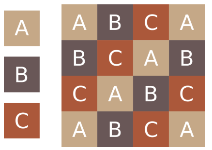

# C - Batik Cap

| Time Limit   | 1s   |
|--------------|------|
| Memory Limit | 64MB |

## Description

Batik Cap is one of the famous technique to produce Indonesian traditional cloth, Batik. In production, it created by stamping the cloth using some copper stamp-like tools called Cap. A Batik Cap cloth consist of small Batik patterns stamped with some rules.

Mr. Blangkon, Head of small Batik Cap Company, asks you to create a program that shows the preview of the Batik Cap cloth before it is produced. You will be given P small Batik patterns (each has size M width x N length), then draw the full-pattern of Batik Cap cloth (that has size R width x C length) after stamped with the P small patterns.

For example, you are given P=3 small Batik patterns A, B, and C (see the figure above). Those small patterns will be stamped on the cloth using the following rules:

1. Stamp the pattern start from the top-left part of the cloth. Stamp without rotating neither the Cap nor the cloth.
2. Stamp downward (on first column) with following the pattern order: A, B, C, A, B, C, and so on
3. After you reach the bottom of the cloth, then you start again from the top of the next column (second column)
4. Every time you move to the next column, the next pattern order is shifted once so in the second column it become: B, C, A, B, C, A, and so on.
5. Stamp downward, until reach the bottom of the cloth.
6. Repeat step number 3 to 5 until all cloth fully-stamped

## Input Format

The first line of the input is an integer T denoting the number of cases. Each case start with a line contains of five integers: P, M, N, R, and C as explained in the problem description above, then followed with P small patterns that has size M x N.

## Output Format

For each case output "Case #X:" on the first line, where X is the case number starts from 1, Then followed with R x C string the result of Batik Cap cloth.

## Sample Input 1

	1
	3 2 2 8 8
	..
	..
	||
	||
	//
	//

## Sample Output 1

	Case #1:
	..||//..
	..||//..
	||//..||
	||//..||
	//..||//
	//..||//
	..||//..
	..||//..

## Sample Input 2

	1
	3 2 2 6 8
	..
	..
	||
	||
	//
	//

## Sample Output 2

	Case #1:
	..||//..
	..||//..
	||//..||
	||//..||
	//..||//
	//..||//

## Constraint

- 1 ≤ T ≤ 20
- 1 ≤ P ≤ 5
- 1 ≤ M, N ≤ 5
- 1 ≤ R, C ≤ 50
- R mod M = 0 and C mod N = 0
- Patterns may contains any character except whitespace
